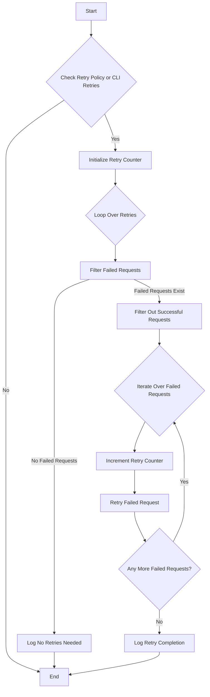

```js
// This block checks if a retry policy is defined or if there are retry attempts specified via command line arguments.
if (retryPolicy || argv?.retries) {
    // Initialize a counter for tracking the number of retries.
    let i = 0;

    // Start a loop to execute retry attempts. The loop runs for the number of total retry runs defined in the retry policy 
    // or the number of retries specified via command line arguments, whichever is available.
    for (let r = 0; (retryPolicy?.totalRetryRuns || argv?.retries || 1) > r; r++) {
        console.log('checking for possible retry');

        // Filters out failed requests from the data array. A request is considered failed if its status is not 200.
        let retryBatch = data?.flat()?.filter(r => r?.status !== 200);

        // If there are no failed requests left to retry, log the condition and exit the loop.
        if (retryBatch?.length == 0) {
            console.log(retryBatch?.length == 0);
            break; // Exit the retry loop since there are no failed requests to retry.
        }

        // Re-filter the data array to exclude the requests that will be retried, leaving only successful requests.
        data = data?.flat()?.filter(r => r?.status == 200);

        // Iterate through each failed request to retry them individually.
        for await (retry of retryBatch) {
            i++; // Increment the retry counter.
            console.log('retrying ', i);
            // Attempt to resend the failed request and store the result.
            let result = await axiosDataReturn(retry?.opt, { batchNumber: i, size: retry?.opt?.data?.requests?.length });
            data.push(result); // Add the result of the retry attempt back into the data array.
        }
    }
}

```


