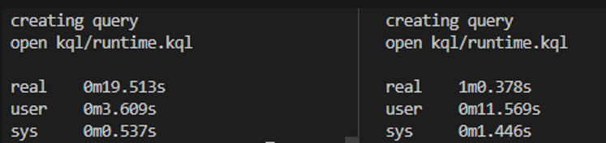
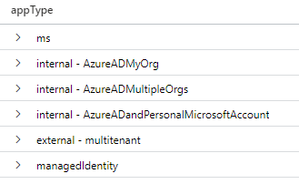
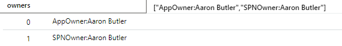
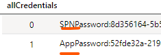
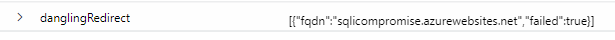
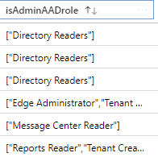

- [Azure AD Application Analytics Solution](#azure-ad-application-analytics-solution)
- [Before using this tool](#before-using-this-tool)
- [Release notes](#release-notes)
  - [List of checks](#list-of-checks)
- [Requirements and operation](#requirements-and-operation)
  - [Operation](#operation)
  - [After running the tool](#after-running-the-tool)
- [Limitations](#limitations)
- [Contribution](#contribution)


# Azure AD Application Analytics Solution

Major Refactor of previous [solution](https://github.com/jsa2/CloudShellAadApps/tree/public#consent-and-azure-ad-application-analytics-solution) 
 - You can read about some of the use cases in the previous solutions documentation [solution](https://github.com/jsa2/CloudShellAadApps/tree/public#consent-and-azure-ad-application-analytics-solution) 

# Before using this tool 
Read the [MIT license](LICENSE)

⚠ Only use this tool if you know what you are doing and have reviewed the code

⚠ Always test the tool first in test environments with non-sensitive data

# Release notes

    Beta v 0.1.5
    - Uses now DefaultAzureCredential to create SAS tokens and upload blobs as per JonneK pull request
    Beta v 0.1.0
    - Compared to previous version uses now JSON batching and larger resultsize across all queries. 2-3x faster than the previous version
    - Release for Azure Security meetup UG

**Major performance improvement with JSON batching**


## List of checks 

1. List app type



2. Collect appOwners from both objects (when both exist) spn and application



3. Collect all credential types from both objects (when both exist) spn and application



4. Review replyUrls for dangling DNS records 



- Please note, in case of multitenant app, these values might be outdated (ReplyURL changes are not reflected visibly on the resulting SPN object, but are nonetheless effective)

5. Check if the object has been assigned AAD roles



6. List API permissions in the following format 
  ```json
{ "permissionsReading": [
          "\"AppRole --> api-15764 --> Microsoft Graph - permission: PrivilegedAccess.Read.AzureAD\"",
          "\"AppRole --> api-15764 --> Microsoft Graph - permission: RoleManagement.Read.All\"",
          "\"AppRole --> api-15764 --> Microsoft Graph - permission: PrivilegedAccess.Read.AzureResources\"",
          "\"AppRole --> api-15764 --> Microsoft Graph - permission: PrivilegedAccess.Read.AzureADGroup\"",
          "\"AppRole --> api-15764 --> Office 365 Management APIs - permission: ActivityFeed.Read\"",
          "\"oauth2PermissionGrants --> AllPrincipals --> Microsoft Graph - permission: User.Read\"",
          "\"oauth2PermissionGrants --> AllPrincipals --> Microsoft Graph - permission: Directory.AccessAsUser.All\"",
          "\"oauth2PermissionGrants --> admin santasalo --> Microsoft Graph - permission: User.Read\"",
      ]
    }
  ```


# Requirements and operation

Access to Azure Cloud Shell (Bash)
- Permissions to [create](#provision-new) new storage account or to use [existing](#use-existing-storage-account) one.
- Access to Log Analytics workspace 
- Azure CLI installed (this get tokens from the underlying Azure CLI installation)
- Storage Blob Contributor Role on the Storage Account 

https://learn.microsoft.com/en-us/azure/storage/blobs/assign-azure-role-data-access?tabs=portal


  
| Requirement                                                    | description                                                                                                                                                                                                                                                                                                                                           |
| -------------------------------------------------------------- | ----------------------------------------------------------------------------------------------------------------------------------------------------------------------------------------------------------------------------------------------------------------------------------------------------------------------------------------------------- |
| ✅ Access to Azure Cloud Shell Bash                             | Uses pre-existing software on Azure CLI, Node etc                                                                                                                                                                                                                                                                                                     |
| ✅ Permissions to Azure subscription to create needed resources | Tool creates a storage account and a resource group. Possible also to use existing storage account. In both scenarios tool generates short lived read-only shared access links (SAS) for the ``externalData()`` -[operator](https://docs.microsoft.com/en-us/azure/data-explorer/kusto/query/externaldata-operator?pivots=azuredataexplorer#examples) |
| ✅ User is Azure AD member                                      | Cloud-only preferred with read-only Azure AD permissions. More permissions are needed if sign-in events are included                                                                                                                                                                                                                                  |
| ✅ Existing Log Analytics Workspace                             | This is where you paste the output from this tool                                                                                                                                                                                                                                                                                                     |


 **About the generated KQL**
- The query is valid for 10 minutes, as SAS tokens are only generated for 10 minutes


**Start**

    git clone https://github.com/jsa2/AADAppAudit

    cd AADAppAudit

## Operation


If you are running the tool in Azure Cloud Shell then all depedencies are already installed

**If you want to use with SAS token** use this [branch](https://github.com/jsa2/AADAppAudit/tree/SASTokenVer#use-existing-storage-account) instead 

```sh
# in the folder where the solution was installed 
npm install

node main yourstorageaccountshortname

# paste the code in runtime.kql to the desired log analytics worspace
# "navigate to kql/runtime.kql if code does not open up


```
**Run the pasted query in the workspace**


## After running the tool

- Remove installation of this service (removes the json files that were stored for the query)
- Delete the resource group (if you provisoned new one) ``az group delete -n $rg`` 


# Limitations

This tool supports paginated results for the initial batch creation. The later operations which are done by Native MS Graph JSON batching at this point do not look for paginated results. This means that if there is an app, that has more than 999 appRoleAssignments, it will only display the first 999 assignments that are granted for that app (technical limit of these assignments is 1500, so it is possible that some app has been given more than 999 assignments)
- Same applies for app that has more than 999 client secrets.


https://learn.microsoft.com/en-us/azure/azure-resource-manager/management/azure-subscription-service-limits#azure-active-directory-limits


# Contribution
Feel free to open issue or pull requests
